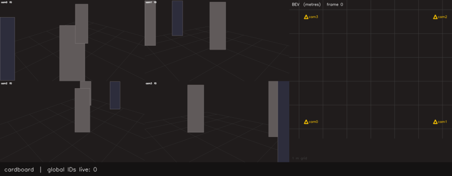
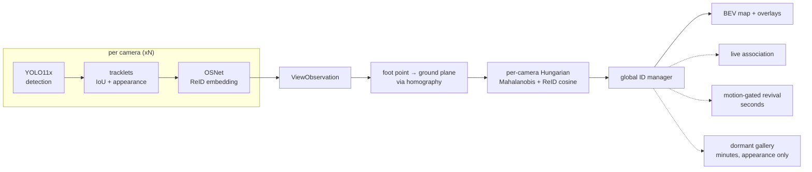

# mcreid — multi-camera persistent-ID tracking with a live BEV map

A few overlapping cameras, one global ID per person. Someone entering any view
gets an identity and keeps it across camera handoffs, through occlusions — even
total occlusion from every camera at once — and across absences of minutes.

The target regime is **one to a handful of people in a room**, not crowds. That
is where a purely geometric, zero-training system does well, and the project is
scoped to it deliberately. Where it stops working is measured and written down
rather than left out: see [Stress test](#stress-test--where-this-breaks-and-why).

**Zero training by us.** Every component is off-the-shelf and pretrained by
someone else — YOLO11x on COCO for detection, OSNet on MSMT17 for appearance —
and none of them has seen any evaluation data used here. The fusion is geometric.



*The hero scenario: one person, four cameras, progressively occluded — one
camera, then two, then three, then **all four** for 2.5 s. The BEV dot switches
to a hollow coasting ring, holds its ID through the blackout, and re-locks on the
same ID when the person reappears.*

> **This GIF is the synthetic reproduction of the scenario, not real footage.**
> The real four-camera capture is pending — the recording protocol is written and
> ready, and the synthetic scene reproduces its exact geometry and occlusion
> timeline so only the detector front-end is new when the clips arrive.

---

## Results

### Primary — persistent ID under occlusion

Synthetic, five seeds. The scene is not a single agent: it contains the hero, a
second person present throughout, and a persistent false positive, because with
one agent alone "zero ID switches" is achievable by any tracker that never mints
a second identity — a stateless 25-line stub passed an earlier version of this
gate, so the scene composition is now asserted by a test.

Seeds 1, 7, 42, 123, 2024. Reproduce any row with
`uv run mcreid-demo synthetic --scenario cardboard --seed <s>`, or all of it with
`uv run pytest tests/test_pipeline_integration.py tests/test_pipeline_long_gap.py`.

| measurement | result |
|---|---|
| hero keeps its ID through the 2.5 s four-camera blackout | **4/5 seeds** — fails on seed 1 |
| hero ID switches across the whole clip | **0 on 2/5 seeds, 1 on the other 3** |
| BEV dot alive through the blackout | **75/75 frames, all 5 seeds** |
| scene-wide switches (hero + distractor + false positive) | 1 on four seeds, **3 on seed 1** |
| long-gap re-ID, 75 s absence, distractor present throughout | identity **recovered under its original ID** on all seeds |
| adversarial long-gap, stranger present only during the absence | stranger **never** inherits the dormant identity |

The last two rows assert *recovery*, not a clean path: a duplicate track can exist
for ~4 frames at the instant of reappearance, because the returning person is
confirmed by one camera before the multi-camera cluster resurrects the real ID.
It self-heals via the duplicate merge and costs counted switches while it lasts.

The appearance model in this generator is **fitted to the operating point
measured on real WILDTRACK crops**, not to published ReID numbers. Published
figures describe a model trained on the target domain and are ~8× easier than the
zero-shot reality this stack ships; gates calibrated against them passed while
the real system under-merged badly. Recalibrating cost the cardboard gate its
former perfect score, which is the point — see [Limitations](#limitations).

### Calibration

| quantity | bound enforced by the suite | reproduce |
|---|---|---|
| intrinsics recovery from a synthetic checkerboard | fx, fy, cx, cy within **2 %** of truth; reprojection RMS **< 0.5 px** | `pytest tests/test_calib_intrinsics.py` |
| ground homography, exact 4-point fit | residual **< 1e-9** | `pytest tests/test_calib_homography.py` |
| ground homography, RANSAC fit under noise | RMS **< 0.05 px** | same |
| image → world round-trip on the ground plane | RMS error **< 1e-6 m** | same |
| WILDTRACK converter cross-check vs dataset GT | **2.97–15.3 px median** per camera, 2249 samples | `mcreid-wildtrack calib-report` |

The first four are the tolerances the tests actually assert, which is what a
clone can verify. A one-off synthetic capture measured tighter than these
(sub-0.4 % focal error, 0.1 cm homography residual, 4–16 mm floor error), but
that run's artifact is not in the repository, so the looser test-enforced bounds
are what is claimed here. The WILDTRACK row is backed by a committed artifact:
[`docs/artifacts/wildtrack_calib_summary.json`](docs/artifacts/wildtrack_calib_summary.json).
Note what it validates — *our converter*, by cross-checking WILDTRACK's
ground-plane annotations against its per-view boxes. It does not validate
WILDTRACK's own calibration.

---

## Stress test — where this breaks, and why

WILDTRACK is deliberately outside the target regime: 7 cameras over a public
square, dozens of people at once, wide baselines, 400 annotated frames at 2 fps.
It is run here as a **failure analysis**, not as a benchmark claim. Full
write-up: [docs/wildtrack_results.md](docs/wildtrack_results.md).

> **No WILDTRACK render ships with this repo.** The frames are EPFL's, they show
> identifiable members of the public, and this project's position is that dataset
> pixels are not redistributed — a rendered animation of them is still the data.
> Reproduce it locally in about a minute once the dataset is fetched:
>
> ```bash
> uv run mcreid-wildtrack-demo --root data/wildtrack_full --n-frames 120
> ```
>
> What it shows, and the reason this section exists: one number and one colour do
> still follow a person across views — `[3cam]` marks a track fused across three
> views — but the BEV map is visibly denser than the number of real people. The
> tables below quantify exactly that.

### The cause: a bounding box's bottom edge is not a foot

This is the finding, and it is upstream of everything else. The same person's
ground position, computed independently from two cameras:

| | ground-truth boxes | **detector boxes** |
|---|---|---|
| mean disagreement | 0.12 m | **1.60 m** |
| p90 | 0.21 m | **4.50 m** |
| beyond the 1.0 m clustering radius | 0 % | **31 %** |

The projection maths is sound — given clean boxes, the cameras agree to 12 cm.
But the bottom edge of a detection box is the ground-contact point only when the
feet are visible, and in a crowd they are routinely occluded, so the box
truncates at whoever is standing in front. A third of the same person's
detections therefore land more than a metre apart, and **no clustering radius can
group them**. The system consequently emits ~2.5× more ground-plane detections
than there are people.

Everything downstream inherits this. Appearance thresholds, association cost
weights and a geometry-only merge were each swept and measured; none moved the
result, because the broken part is the input geometry, not the matcher.

### What that costs, in numbers

<!-- RESULTS_TABLE_START — regenerate with scripts/make_results_table.py -->
| configuration | MODA | MODP | precision | recall | ID switches | IDs reported |
|---|---|---|---|---|---|---|
| geometric fusion + ImageNet trunk (no ReID) | −118.7 % | 64.2 % | 26.9 % | 69.3 % | 741 | 1000 |
| geometric fusion + off-the-shelf ReID (zero training by us) | −118.8 % | 64.1 % | 26.9 % | 69.4 % | **636** | **943** |
| MVDet (Hou et al., ECCV 2020) — **trained on WILDTRACK** | deliberately not transcribed — see note | — | — | — | n/a | n/a |

400 frames, 7 cameras, 313 ground-truth identities. Position RMSE 0.29 m for
both. Runtime 7.7 FPS/camera, 1.10 FPS aggregate at 7×1080p on an RTX 4060
Laptop (9.7 / 1.38 for the lighter ImageNet trunk).

Every figure in this section is checkable without downloading the dataset: the
raw run summaries are committed under
[`docs/artifacts/`](docs/artifacts/README.md), and the table above regenerates
from them:

```bash
python scripts/make_results_table.py docs/artifacts/wildtrack_eval_imagenet.json docs/artifacts/wildtrack_eval_osnet.json
```

MODA charges every false positive against the ground-truth count, so the
duplicate detections above put it deeply negative: 17910 false positives against
6606 true. Recall is fine (69 %); precision is not (27 %).

MVDet is trained *on WILDTRACK*; this is zero-shot, and the two are not
comparable on equal terms. Its numbers are left blank rather than recalled
approximately — a fabricated benchmark figure sitting next to real measurements
is worse than a visible gap.

### The embedder is not the bottleneck here

Cross-camera cosine distance, measured on real WILDTRACK crops with ground-truth
identities:

| embedder | same person, diff. camera | different person, diff. camera | separation |
|---|---|---|---|
| ImageNet ResNet-18 (not a ReID model) | 0.377 | 0.409 | **0.032** |
| OSNet, MSMT17-trained | 0.525 | 0.623 | **0.098** |

Swapping the ImageNet trunk for a real ReID model is a 3× improvement in
separation and it does help identity: ID switches 741 → 636, reported identities
1000 → 943. But MODA, MODP, precision and recall are unchanged to three decimals,
because those are dominated by duplicate detections rather than identity
confusion. A better embedder cannot fix a bad foot point.

---

## How it works



Identity recovery is a three-stage ladder, each less constrained than the last,
tried in order:

1. **Live association** — per-camera Hungarian on ground distance blended with
   ReID cosine. Geometry and appearance both vote.
2. **Motion-gated revival** — "could they have walked here in the time they were
   missing?" Serves occlusions of seconds.
3. **Dormant gallery** — appearance only, no position claim, 10-minute TTL.
   Serves absences of minutes. Because nothing constrains it but appearance it is
   the strictest stage: tighter threshold, top-k mean instead of max-similarity,
   and a ratio test that resurrects nothing when two identities fit comparably.

Every design decision above was forced by measurement rather than taste; the
ones that cost the most to learn are in [Limitations](#limitations) and
[Stress test](#stress-test--where-this-breaks-and-why).

---

## Quickstart

```bash
uv venv --python 3.11 && uv pip install -e ".[dev]"
```

Run the whole pipeline on a scripted scene — no footage, no GPU, no dataset:

```bash
uv run mcreid-demo synthetic --scenario cardboard
```

> **Expect this to print `cardboard criterion: FAIL (1 of 5)` and exit 1.** That is
> the honest current bar, not a broken install. On the default seed the hero holds
> its identity through the whole 2.5 s four-camera blackout and the BEV dot never
> drops a frame — but the *distractor* takes one ID switch, and the gate is
> scene-wide, so one switch anywhere fails it. The four other criteria pass. The
> gate was deliberately left strict rather than rescoped to the hero, because an
> earlier, laxer version of it was passed by a 25-line stateless stub with no ReID,
> no Kalman filter and no lifecycle at all. Seeds 7 and 42 are the two of five with
> a clean hero; see [Results](#results) for the full distribution and
> [Limitations](#limitations) for why the perfect score is gone.

It writes `outputs/demo/cardboard.mp4` and `.gif`.

Install the perception stack (CUDA 12.6) for anything involving real video:

```bash
uv pip install -e ".[perception]" --extra-index-url https://download.pytorch.org/whl/cu126
```

### WILDTRACK

```bash
python scripts/download_wildtrack.py fetch
```

```bash
uv run mcreid-wildtrack calib-report --root data/wildtrack_full
```

```bash
uv run mcreid-wildtrack run --root data/wildtrack_full --n-frames 400
```

```bash
uv run mcreid-wildtrack-demo --root data/wildtrack_full --n-frames 120
```

### Live webcam — single camera, no calibration needed

```bash
uv run mcreid-live --device 0
```

Runs the full per-view stack on a webcam: detection, appearance, tracking,
occlusion coasting, and dormant-gallery re-identification for someone who leaves
the frame and comes back. The overlay shows each box with its global ID, colour,
track state, and how long that identity has been held; the banner reports the
end-to-end frame rate, live track count, and **"ID N reacquired after Xs gap"**
when the long-gap gallery recovers someone. Hotkeys: `q` quit, `s` save the last
few seconds to `reports/` (written at the measured capture rate, so it plays
back at life speed).

Calibration is optional — with one camera there is no cross-view fusion, so
identity does not depend on knowing the floor plane. Pass a 4-point YAML to get
the metric BEV panel as well:

```bash
uv run mcreid-live --device 0 --homography calib/floor_4point.yaml
```

```yaml
image_points: [[420, 980], [1500, 980], [1310, 640], [610, 640]]
world_points: [[0.0, 0.0], [3.0, 0.0], [3.0, 4.0], [0.0, 4.0]]
```

Defaults to `yolo11s` at `--imgsz 960`. Measured on an RTX 4060 Laptop at
1280x720 with one person in frame: **19–21 FPS end-to-end** — capture, detect,
embed, track, render, display — against a tracking-only throughput of 32–34 FPS.
Both numbers are printed, and they are not interchangeable: the gap is the
webcam read and the `imshow`, so the tracking stack has roughly a third more
headroom than the session rate suggests. Use `--weights weights/yolo11x.pt` for
accuracy over speed.

The end-of-run summary reports **identities confirmed and shown** alongside the
raw mint counter. Only the first is a count of people: a single-frame false
detection mints a tentative track that the lifecycle deletes three frames later,
so the mint counter climbs on a live camera even when identity is perfectly
stable.

### Your own cameras — multi-camera rig

```bash
uv run mcreid-calibrate rig --capture-dir footage/calib --square-size-m 0.025
```

```bash
uv run mcreid-calibrate report --calib calib/rig.json --capture-dir footage/calib
```

`report` is a hard gate: it renders a metric floor grid into every view and
refuses to pass a calibration that does not reproduce it, printing what to
re-measure when it fails.

---

## Limitations

- **The headline scenario is not perfect, and the numbers are synthetic.** On the
  cardboard gate the hero takes **1 ID switch on 3 of 5 seeds** and survives the
  2.5 s total occlusion on 4 of 5. An earlier version of this README reported
  zero switches on every seed; that result was real but measured a generator
  calibrated to *published* ReID numbers, i.e. a model trained on the target
  domain. Refitting the generator to the zero-shot operating point actually
  measured on WILDTRACK cost the perfect score. The old number is not
  recoverable by tuning — appearance weight, cost ceiling and every gate
  threshold were swept with no effect. **Real four-camera footage has not been
  captured yet**, so no real-world number exists for this scenario at all.
- **Crowds break precision.** On WILDTRACK the tracker emits ~2.5× more
  ground-plane detections than there are people, giving a strongly negative
  MODA. The cause is measured, not guessed: occlusion-truncated detection boxes
  put the same person more than a metre apart between cameras a third of the
  time (0.12 m with clean boxes, 1.60 m mean with detector boxes). This is the
  single biggest open problem in the project, and it is a *geometry* problem —
  a better appearance model does not touch it.
- **Runtime is not real-time at 7×1080p.** 7.7 FPS per camera, 1.10 FPS aggregate
  across seven 1080p streams — from
  [`docs/artifacts/wildtrack_eval_osnet.json`](docs/artifacts/wildtrack_eval_osnet.json),
  on an RTX 4060 Laptop. No target is claimed for that load. Detection dominates:
  per-view tracking plus fusion measured 1–2 ms/frame, so essentially the whole
  budget is the detector. That last figure is a development measurement on the
  same machine with no artifact in this repo and no benchmark in the suite —
  treat the ratio as indicative, not as a result.
- **"Zero training" means zero training *by us*.** The detector and the ReID
  model are both pretrained on public data. Neither has seen the evaluation
  data, so the evaluation is zero-shot, but this is not a from-scratch system
  and is not claimed to be.
- **Coasting is short-lived accuracy.** Through a 2.5 s total occlusion the BEV
  dot survives the whole time and the identity is retained, but the
  constant-velocity prediction only stays within a metre of truth for about half
  of it. The rest of the identity is recovered by the ReID re-lock, not by the
  motion model. Say it that way.
- **The synthetic suite is a proxy, not proof.** It is now fitted to a measured
  operating point, but it still models appearance as a vector plus noise. It
  caught none of the failures that real footage exposed — including the
  foot-point problem, which it cannot represent at all.

## v2 directions

In the order they would pay off:

1. **Stature-based foot-point estimator.** Infer the ground-contact point from
   box *height* and an assumed stature under the known camera geometry, instead
   of trusting the bottom edge. This targets the measured root cause directly and
   is the highest-value change available; everything else is downstream of it.
2. **Trained multi-view fusion (MVDet-style).** Project per-view features to a
   shared ground-plane feature map and learn the occupancy decision, rather than
   projecting a single point per detection and clustering by hand. This replaces
   the brittle foot-point-plus-radius pipeline outright, at the cost of the
   zero-training property.
3. **Synthetic multi-view data engine.** Needed to train either of the above
   without hand-labelling: exact ground-truth positions, controllable occlusion,
   and calibration that is correct by construction. Design note already written
   in [`scripts/README_v2_synthetic_engine.md`](scripts/README_v2_synthetic_engine.md);
   the case for it is now measured rather than assumed.

---

## Repo layout

```
src/mcreid/
  calib/    calib.json schema, intrinsics, ground homography, projection, sanity report
  sim/      virtual cameras, scripted scenes, synthetic rendering
  track/    per-view tracking; CPU path and GPU path (YOLO + selectable ReID)
  fusion/   ground Kalman, appearance gallery, association, global IDs, dormant gallery
  eval/     identity metrics, WILDTRACK protocol (MODA/MODP)
  viz/      BEV canvas, overlays, demo composition
  live.py   single-camera live session (testable without a camera or GPU)
  cli/      calibrate · demo · live · sync · eval · wildtrack · wildtrack-demo
```

- [docs/wildtrack_results.md](docs/wildtrack_results.md) — real-footage validation

## Credit where it is due

This project trains nothing. Everything that does the perceptual work is someone
else's, and the parts worth naming are:

- **OSNet** — Zhou, Yang, Cavallaro, Xiang, *Omni-Scale Feature Learning for
  Person Re-Identification*, ICCV 2019. Architecture vendored from
  [Torchreid](https://github.com/KaiyangZhou/deep-person-reid) (MIT); the
  `osnet_x1_0` MSMT17 weights are the authors'.
- **YOLO11** — [Ultralytics](https://github.com/ultralytics/ultralytics), AGPL-3.0.
  Detection only; COCO-pretrained, `yolo11s` by default and `yolo11x` for accuracy.
- **WILDTRACK** — Chavdarova et al., *WILDTRACK: A Multi-camera HD Dataset for
  Dense Unscripted Pedestrian Detection*, CVPR 2018. EPFL CVLab. Used as a stress
  test under the dataset's own terms; not redistributed.
- **MVDet** — Hou, Zheng, Gould, *Multiview Detection with Feature Perspective
  Transformation*, ECCV 2020. Referenced as the trained-fusion point of comparison
  and as the design this project's v2 direction would follow.
- **MODA / MODP** — the CLEAR multi-object detection metrics
  (Kasturi et al., 2009), as used by the WILDTRACK protocol.

**No third-party tracker is used anywhere.** Ultralytics provides detection only;
its built-in BoT-SORT/ByteTrack are deliberately *not* delegated to, because they
do not expose a stable per-tracklet appearance vector (see
`src/mcreid/track/gpu_view.py`). Both the CPU and GPU per-view paths run this
repository's own `PerViewTracker`, and cross-camera association is its own
per-camera Hungarian on Mahalanobis ground distance blended with ReID cosine,
plus a ground-plane Kalman filter and the three-stage recovery ladder above.

## Licence

AGPL-3.0-only — full text in [LICENSE](LICENSE). The strong copyleft is not a
preference: the GPU detection path depends on Ultralytics YOLO11, which is
AGPL-3.0, so anything distributing this pipeline inherits that obligation.

The vendored OSNet architecture is MIT and carries its own notice — see
`src/mcreid/track/vendor/osnet.py`.

Third-party data and weights are **not** redistributed here. WILDTRACK is
obtained from EPFL CVLab under their terms via `scripts/download_wildtrack.py`;
OSNet weights are fetched from the authors and SHA-256 pinned. No dataset
frames, and no renders derived from them, are committed to this repository.
