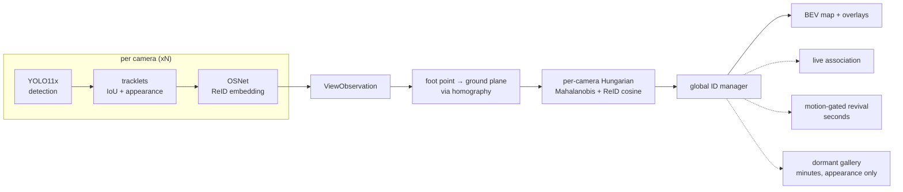

# mcreid — multi-camera persistent-ID tracking with a live BEV map

A few overlapping cameras, one global ID per person. Someone entering any view
gets an identity and keeps it across camera handoffs, through occlusions — even
total occlusion from every camera at once — and across absences of minutes.

The target regime is **one to a handful of people in a room**, not crowds. That
is where a purely geometric, zero-training system does well, and the project is
scoped to it deliberately. Where it stops working is measured and written down
rather than left out: see [Stress test](#stress-test--where-this-breaks-and-why).

**Zero training by us.** Every component is off-the-shelf and pretrained by
someone else — YOLO11x on COCO for detection, OSNet on MSMT17 for appearance —
and none of them has seen any evaluation data used here. The fusion is geometric.


*The hero scenario: one person, four cameras, progressively occluded — one
camera, then two, then three, then **all four** for 2.5 s. The BEV dot switches
to a hollow coasting ring, holds its ID through the blackout, and re-locks on the
same ID when the person reappears.*

> **This GIF is the synthetic reproduction of the scenario, not real footage.**
> The real four-camera capture is pending — the recording protocol is written and
> ready in [capture_guide.md](capture_guide.md), and the synthetic scene
> reproduces its exact geometry and occlusion timeline so only the detector
> front-end is new when the clips arrive.

---

## Results

### Primary — persistent ID under occlusion

Synthetic, five seeds. The scene is not a single agent: it contains the hero, a
second person present throughout, and a persistent false positive, because with
one agent alone "zero ID switches" is achievable by any tracker that never mints
a second identity — a stateless 25-line stub passed an earlier version of this
gate, so the scene composition is now asserted by a test.

| scenario | result |
|---|---|
| cardboard, 2.5 s total occlusion from all four cameras | hero holds its ID on **4/5 seeds**; ≤1 switch on any seed |
| BEV dot alive through the blackout | **75/75 frames, all seeds** |
| long-gap re-ID (75 s absence, distractor present throughout) | **0 switches**, identity recovered on all seeds |
| adversarial long-gap (a stranger present only during the absence) | stranger **never** inherits the dormant identity |

The appearance model in this generator is **fitted to the operating point
measured on real WILDTRACK crops**, not to published ReID numbers. Published
figures describe a model trained on the target domain and are ~8× easier than the
zero-shot reality this stack ships; gates calibrated against them passed while
the real system under-merged badly. Recalibrating cost the cardboard gate its
former perfect score, which is the point — see [Limitations](#limitations).

### Calibration

| quantity | result |
|---|---|
| focal length error (synthetic capture) | < 0.4 % |
| ground homography residual | 0.1 cm |
| image → world floor position error | 4–16 mm mean |
| WILDTRACK converter cross-check vs dataset GT | 3–15 px median per camera |

---

## Stress test — where this breaks, and why

WILDTRACK is deliberately outside the target regime: 7 cameras over a public
square, dozens of people at once, wide baselines, 400 annotated frames at 2 fps.
It is run here as a **failure analysis**, not as a benchmark claim. Full
write-up: [docs/wildtrack_results.md](docs/wildtrack_results.md).


*Three of the seven cameras and the BEV, real footage. One number and one colour
still follow a person across views — `[3cam]` marks a track fused across three
views — but the map is visibly denser than the number of real people.*

### The cause: a bounding box's bottom edge is not a foot

This is the finding, and it is upstream of everything else. The same person's
ground position, computed independently from two cameras:

| | ground-truth boxes | **detector boxes** |
|---|---|---|
| mean disagreement | 0.12 m | **1.60 m** |
| p90 | 0.21 m | **4.50 m** |
| beyond the 1.0 m clustering radius | 0 % | **31 %** |

The projection maths is sound — given clean boxes, the cameras agree to 12 cm.
But the bottom edge of a detection box is the ground-contact point only when the
feet are visible, and in a crowd they are routinely occluded, so the box
truncates at whoever is standing in front. A third of the same person's
detections therefore land more than a metre apart, and **no clustering radius can
group them**. The system consequently emits ~2.5× more ground-plane detections
than there are people.

Everything downstream inherits this. Appearance thresholds, association cost
weights and a geometry-only merge were each swept and measured; none moved the
result, because the broken part is the input geometry, not the matcher.

### What that costs, in numbers

<!-- RESULTS_TABLE_START — regenerate with scripts/make_results_table.py -->
| configuration | MODA | MODP | precision | recall | ID switches | IDs reported |
|---|---|---|---|---|---|---|
| geometric fusion + ImageNet trunk (no ReID) | −118.7 % | 64.2 % | 26.9 % | 69.3 % | 741 | 1000 |
| geometric fusion + off-the-shelf ReID (zero training by us) | −118.8 % | 64.1 % | 26.9 % | 69.4 % | **636** | **943** |
| MVDet (Hou et al.) — **trained on WILDTRACK** | _TODO: fill from paper_ | _TODO_ | _TODO_ | _TODO_ | n/a | n/a |

400 frames, 7 cameras, 313 ground-truth identities. Position RMSE 0.29 m for
both. Runtime 7.7 FPS/camera, 1.10 FPS aggregate at 7×1080p on an RTX 4060
Laptop (9.7 / 1.38 for the lighter ImageNet trunk).

MODA charges every false positive against the ground-truth count, so the
duplicate detections above put it deeply negative: 17910 false positives against
6606 true. Recall is fine (69 %); precision is not (27 %).

MVDet is trained *on WILDTRACK*; this is zero-shot, and the two are not
comparable on equal terms. Its numbers are left blank rather than recalled
approximately — a fabricated benchmark figure sitting next to real measurements
is worse than a visible gap.

### The embedder is not the bottleneck here

Cross-camera cosine distance, measured on real WILDTRACK crops with ground-truth
identities:

| embedder | same person, diff. camera | different person, diff. camera | separation |
|---|---|---|---|
| ImageNet ResNet-18 (not a ReID model) | 0.377 | 0.409 | **0.032** |
| OSNet, MSMT17-trained | 0.525 | 0.623 | **0.098** |

Swapping the ImageNet trunk for a real ReID model is a 3× improvement in
separation and it does help identity: ID switches 741 → 636, reported identities
1000 → 943. But MODA, MODP, precision and recall are unchanged to three decimals,
because those are dominated by duplicate detections rather than identity
confusion. A better embedder cannot fix a bad foot point.

---

## How it works



Identity recovery is a three-stage ladder, each less constrained than the last,
tried in order:

1. **Live association** — per-camera Hungarian on ground distance blended with
   ReID cosine. Geometry and appearance both vote.
2. **Motion-gated revival** — "could they have walked here in the time they were
   missing?" Serves occlusions of seconds.
3. **Dormant gallery** — appearance only, no position claim, 10-minute TTL.
   Serves absences of minutes. Because nothing constrains it but appearance it is
   the strictest stage: tighter threshold, top-k mean instead of max-similarity,
   and a ratio test that resurrects nothing when two identities fit comparably.

Design decisions worth knowing, all forced by measurement rather than taste, are
in [context.md](context.md) §4.

---

## Quickstart

```bash
uv venv --python 3.11 && uv pip install -e ".[dev]"
```

Run the whole pipeline on a scripted scene — no footage, no GPU, no dataset:

```bash
uv run mcreid-demo synthetic --scenario cardboard
```

Install the perception stack (CUDA 12.6) for anything involving real video:

```bash
uv pip install -e ".[perception]" --extra-index-url https://download.pytorch.org/whl/cu126
```

### WILDTRACK

```bash
python scripts/download_wildtrack.py fetch
```

```bash
uv run mcreid-wildtrack calib-report --root data/wildtrack_full
```

```bash
uv run mcreid-wildtrack run --root data/wildtrack_full --n-frames 400
```

```bash
uv run mcreid-wildtrack-demo --root data/wildtrack_full --n-frames 120
```

### Your own cameras

```bash
uv run mcreid-calibrate rig --capture-dir footage/calib --square-size-m 0.025
```

```bash
uv run mcreid-calibrate report --calib calib/rig.json --capture-dir footage/calib
```

`report` is a hard gate: it renders a metric floor grid into every view and
refuses to pass a calibration that does not reproduce it. See
[capture_guide.md](capture_guide.md) for the recording protocol.

---

## Limitations

- **The headline scenario is not perfect, and the numbers are synthetic.** On the
  cardboard gate the hero takes **1 ID switch on 3 of 5 seeds** and survives the
  2.5 s total occlusion on 4 of 5. An earlier version of this README reported
  zero switches on every seed; that result was real but measured a generator
  calibrated to *published* ReID numbers, i.e. a model trained on the target
  domain. Refitting the generator to the zero-shot operating point actually
  measured on WILDTRACK cost the perfect score. The old number is not
  recoverable by tuning — appearance weight, cost ceiling and every gate
  threshold were swept with no effect. **Real four-camera footage has not been
  captured yet**, so no real-world number exists for this scenario at all.
- **Crowds break precision.** On WILDTRACK the tracker emits ~2.5× more
  ground-plane detections than there are people, giving a strongly negative
  MODA. The cause is measured, not guessed: occlusion-truncated detection boxes
  put the same person more than a metre apart between cameras a third of the
  time (0.12 m with clean boxes, 1.60 m mean with detector boxes). This is the
  single biggest open problem in the project, and it is a *geometry* problem —
  a better appearance model does not touch it.
- **Runtime is not real-time at 7×1080p.** Measured on an RTX 4060 Laptop: 7.7
  FPS per camera, 1.10 FPS aggregate across seven 1080p streams. No target is
  claimed for that load. Detection dominates — per-view tracking plus fusion
  costs 1–2 ms/frame, so essentially the whole budget is the detector.
- **"Zero training" means zero training *by us*.** The detector and the ReID
  model are both pretrained on public data. Neither has seen the evaluation
  data, so the evaluation is zero-shot, but this is not a from-scratch system
  and is not claimed to be.
- **Coasting is short-lived accuracy.** Through a 2.5 s total occlusion the BEV
  dot survives the whole time and the identity is retained, but the
  constant-velocity prediction only stays within a metre of truth for about half
  of it. The rest of the identity is recovered by the ReID re-lock, not by the
  motion model. Say it that way.
- **The synthetic suite is a proxy, not proof.** It is now fitted to a measured
  operating point, but it still models appearance as a vector plus noise. It
  caught none of the failures that real footage exposed — including the
  foot-point problem, which it cannot represent at all.

## v2 directions

In the order they would pay off:

1. **Stature-based foot-point estimator.** Infer the ground-contact point from
   box *height* and an assumed stature under the known camera geometry, instead
   of trusting the bottom edge. This targets the measured root cause directly and
   is the highest-value change available; everything else is downstream of it.
2. **Trained multi-view fusion (MVDet-style).** Project per-view features to a
   shared ground-plane feature map and learn the occupancy decision, rather than
   projecting a single point per detection and clustering by hand. This replaces
   the brittle foot-point-plus-radius pipeline outright, at the cost of the
   zero-training property.
3. **Synthetic multi-view data engine.** Needed to train either of the above
   without hand-labelling: exact ground-truth positions, controllable occlusion,
   and calibration that is correct by construction. Design note already written
   in [`scripts/README_v2_synthetic_engine.md`](scripts/README_v2_synthetic_engine.md);
   the case for it is now measured rather than assumed.

---

## Repo layout

```
src/mcreid/
  calib/    calib.json schema, intrinsics, ground homography, projection, sanity report
  sim/      virtual cameras, scripted scenes, synthetic rendering
  track/    per-view tracking; CPU path and GPU path (YOLO + selectable ReID)
  fusion/   ground Kalman, appearance gallery, association, global IDs, dormant gallery
  eval/     identity metrics, WILDTRACK protocol (MODA/MODP)
  viz/      BEV canvas, overlays, demo composition
  cli/      calibrate · demo · sync · eval · wildtrack · wildtrack-demo
```

- [context.md](context.md) — scope, locked architecture, design rationale
- [status.txt](status.txt) — current phase, blockers, next steps
- [docs/wildtrack_results.md](docs/wildtrack_results.md) — real-footage validation

## Licence

AGPL-3.0-only. Vendored OSNet architecture is MIT (see
`src/mcreid/track/vendor/osnet.py`).
