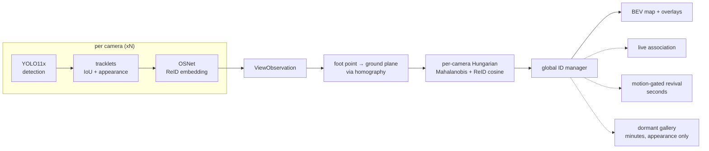

# mcreid — multi-camera persistent-ID tracking with a live BEV map

Multiple overlapping cameras, one global ID per person. Someone entering any
view gets an identity and keeps it across camera handoffs, through occlusions,
and across absences of minutes.

**Zero training by us.** Every component is off-the-shelf and pretrained by
someone else — YOLO11x on COCO for detection, OSNet on MSMT17 for appearance —
and none of them has seen the evaluation data. The fusion is geometric.


*Three WILDTRACK cameras and the bird's-eye map, real footage. Watch one number
and one colour follow a person from camera to camera — that agreement is the
entire claim. `[3cam]` on the map marks a track fused across three views;
`occl` marks one being coasted through an occlusion.*

---

## Results

### Real footage — WILDTRACK

7 static cameras over a public square, 400 annotated frames at 2 fps, 1920×1080.
Nothing here is fine-tuned. Full write-up: [docs/wildtrack_results.md](docs/wildtrack_results.md).

<!-- RESULTS_TABLE_START — regenerate with scripts/make_results_table.py -->
| configuration | MODA | MODP | precision | recall | ID switches | IDs reported |
|---|---|---|---|---|---|---|
| geometric fusion + ImageNet trunk (no ReID) | −118.7 % | 64.2 % | 26.9 % | 69.3 % | 741 | 1000 |
| geometric fusion + off-the-shelf ReID (zero training by us) | −118.8 % | 64.1 % | 26.9 % | 69.4 % | **636** | **943** |
| MVDet (Hou et al.) — **trained on WILDTRACK** | _TODO: fill from paper_ | _TODO_ | _TODO_ | _TODO_ | n/a | n/a |

400 frames, 7 cameras, 313 ground-truth identities. Position RMSE 0.29 m for
both. Runtime 7.7 FPS/camera, 1.10 FPS aggregate at 7×1080p on an RTX 4060
Laptop (9.7 / 1.38 for the lighter ImageNet trunk).

**MODA is strongly negative and that is the honest result.** MODA charges every
false positive against the ground-truth count, and the system emits ~2.5× more
ground-plane detections than there are people: 17910 false positives against
6606 true. Recall is fine (69 %); precision is not (27 %).

**The embedder swap does not fix it.** OSNet is 3× better separated than the
ImageNet trunk and it buys a 14 % reduction in ID switches (741 → 636) and fewer
identities (1000 → 943) — real, but confined to identity metrics. MODA, MODP,
precision and recall are unchanged to three decimals, because they are dominated
by duplicate detections, which is a *geometry* problem.

MVDet is trained *on WILDTRACK*; this is zero-shot. Its numbers are left blank
rather than recalled approximately — a fabricated benchmark figure next to real
measurements is worse than a visible gap.

### Why precision is bad — measured, not guessed

The same person's position, as computed from two different cameras:

| | ground-truth boxes | **detector boxes** |
|---|---|---|
| mean disagreement | 0.12 m | **1.60 m** |
| p90 | 0.21 m | **4.50 m** |
| beyond the 1.0 m clustering radius | 0 % | **31 %** |

The projection maths is sound — with clean boxes, cameras agree to 12 cm. But a
bounding box's bottom edge is only the ground-contact point when the feet are
visible, and in a crowd they are routinely occluded, so the box is truncated at
whoever is standing in front. A third of the same person's detections therefore
land more than a metre apart and **no clustering radius can group them**.

That is why neither appearance thresholds, nor cost weights, nor a
geometry-only merge changed the outcome: the input geometry is the broken part.
The fix is a better ground-contact estimate (e.g. inferring it from box height
and known stature rather than the bottom edge), not a better embedder.

### The appearance model is the whole story

Cross-camera cosine distance, measured on real WILDTRACK crops with
ground-truth identities:

| embedder | same person, diff. camera | different person, diff. camera | separation |
|---|---|---|---|
| ImageNet ResNet-18 (not a ReID model) | 0.377 | 0.409 | **0.032** |
| OSNet, MSMT17-trained | 0.525 | 0.623 | **0.098** |

The v1 stack used the ImageNet trunk, whose distributions essentially overlap —
no threshold separates them, and a `--geometry-only` ablation changed almost
nothing. Swapping in a real ReID model is a 3× improvement in separation and the
single biggest lever in the project.

### Synthetic scenario suite

The synthetic generator's appearance model is **fitted to the measured OSNet
operating point above**, not to published ReID numbers. That distinction matters:
published numbers describe a model trained on the target domain and are ~8×
easier than the zero-shot reality this stack ships. Gates calibrated against the
easy distribution passed while the real system under-merged badly.

| scenario | result |
|---|---|
| cardboard (1 hero + distractor + persistent false positive, 2.5 s total occlusion) | hero holds its ID on 4/5 seeds; ≤1 switch on any seed |
| BEV dot alive through the blackout | 75/75 frames, all seeds |
| long-gap re-ID (75 s absence, distractor present throughout) | 0 switches, identity recovered on all seeds |
| adversarial long-gap (stranger present only during the absence) | stranger never inherits the dormant ID |

### Calibration

| quantity | result |
|---|---|
| focal length error (synthetic capture) | < 0.4 % |
| ground homography residual | 0.1 cm |
| image → world floor position error | 4–16 mm mean |
| WILDTRACK converter cross-check vs dataset GT | 3–15 px median per camera |

---

## How it works



Identity recovery is a three-stage ladder, each less constrained than the last,
tried in order:

1. **Live association** — per-camera Hungarian on ground distance blended with
   ReID cosine. Geometry and appearance both vote.
2. **Motion-gated revival** — "could they have walked here in the time they were
   missing?" Serves occlusions of seconds.
3. **Dormant gallery** — appearance only, no position claim, 10-minute TTL.
   Serves absences of minutes. Because nothing constrains it but appearance it is
   the strictest stage: tighter threshold, top-k mean instead of max-similarity,
   and a ratio test that resurrects nothing when two identities fit comparably.

Design decisions worth knowing, all forced by measurement rather than taste, are
in [context.md](context.md) §4.

---

## Quickstart

```bash
uv venv --python 3.11 && uv pip install -e ".[dev]"
```

Run the whole pipeline on a scripted scene — no footage, no GPU, no dataset:

```bash
uv run mcreid-demo synthetic --scenario cardboard
```

Install the perception stack (CUDA 12.6) for anything involving real video:

```bash
uv pip install -e ".[perception]" --extra-index-url https://download.pytorch.org/whl/cu126
```

### WILDTRACK

```bash
python scripts/download_wildtrack.py fetch
```

```bash
uv run mcreid-wildtrack calib-report --root data/wildtrack_full
```

```bash
uv run mcreid-wildtrack run --root data/wildtrack_full --n-frames 400
```

```bash
uv run mcreid-wildtrack-demo render --root data/wildtrack_full --n-frames 120
```

### Your own cameras

```bash
uv run mcreid-calibrate rig --capture-dir footage/calib --square-size-m 0.025
```

```bash
uv run mcreid-calibrate report --calib calib/rig.json --capture-dir footage/calib
```

`report` is a hard gate: it renders a metric floor grid into every view and
refuses to pass a calibration that does not reproduce it. See
[capture_guide.md](capture_guide.md) for the recording protocol.

---

## Honest limitations

- **Crowds break precision.** On WILDTRACK the tracker emits ~2.5× more
  ground-plane detections than there are people, giving a strongly negative
  MODA. The cause is measured above: occlusion-truncated detection boxes put the
  same person more than a metre apart between cameras a third of the time. This
  is the single biggest open problem in the project.
- **Runtime is not real-time at 7×1080p.** Measured on an RTX 4060 Laptop; the
  numbers are in the results table and no target is claimed for that load.
  Detection dominates — per-view tracking plus fusion costs 1–2 ms/frame.
- **"Zero training" means zero training *by us*.** The detector and the ReID
  model are both pretrained on public data. Neither has seen WILDTRACK, so the
  evaluation is zero-shot, but this is not a from-scratch system and is not
  claimed to be.
- **Coasting is short-lived accuracy.** Through a 2.5 s total occlusion the BEV
  dot survives the whole time and the identity is retained, but the
  constant-velocity prediction only stays within a metre of truth for about half
  of it. The rest of the identity is recovered by the ReID re-lock, not by the
  motion model.
- **The synthetic suite is a proxy, not proof.** It is now fitted to a measured
  operating point, but it still models appearance as a vector plus noise. It
  caught none of the failures that real footage exposed.

---

## Repo layout

```
src/mcreid/
  calib/    calib.json schema, intrinsics, ground homography, projection, sanity report
  sim/      virtual cameras, scripted scenes, synthetic rendering
  track/    per-view tracking; CPU path and GPU path (YOLO + selectable ReID)
  fusion/   ground Kalman, appearance gallery, association, global IDs, dormant gallery
  eval/     identity metrics, WILDTRACK protocol (MODA/MODP)
  viz/      BEV canvas, overlays, demo composition
  cli/      calibrate · demo · sync · eval · wildtrack · wildtrack-demo
```

- [context.md](context.md) — scope, locked architecture, design rationale
- [status.txt](status.txt) — current phase, blockers, next steps
- [docs/wildtrack_results.md](docs/wildtrack_results.md) — real-footage validation

## Licence

AGPL-3.0-only. Vendored OSNet architecture is MIT (see
`src/mcreid/track/vendor/osnet.py`).
